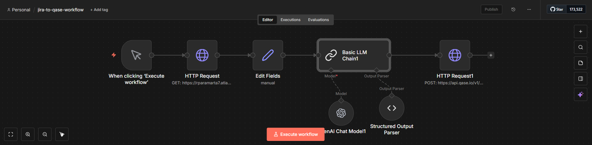
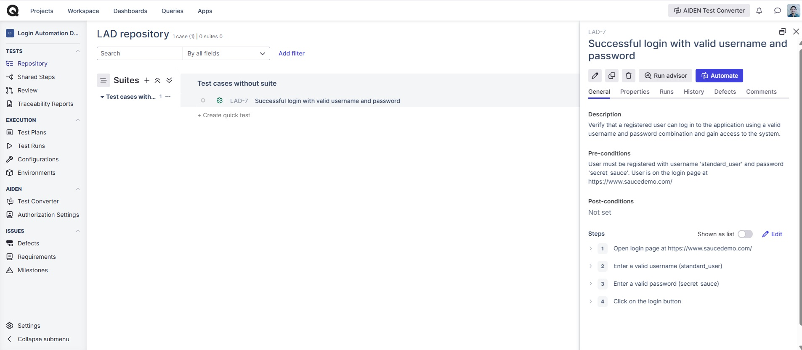

# Jira to Qase Test Case Automation (AI-assisted)

This repository showcases an AI-assisted QA workflow that converts Jira user stories into structured test cases in Qase.io using n8n.

The goal of this project is to reduce repetitive manual work for QA engineers while keeping test cases consistent, traceable, and reviewable.





---

## Background

In many QA teams, test cases are still created manually based on Jira user stories and acceptance criteria.  
This process is:
- Time-consuming
- Prone to inconsistency
- Hard to scale

This workflow demonstrates how automation and AI can assist—not replace—QA engineers in this process.

---

## What This Workflow Does

1. Fetches a Jira issue using Jira REST API
2. Reads the user story description and acceptance criteria
3. Uses an LLM to generate **one structured test case** following Qase.io schema
4. Sends the generated test case to Qase.io via API

The QA engineer still reviews and refines the test case in Qase.

---

## Workflow Architecture

Jira Issue  
→ n8n (HTTP Request)  
→ Data Mapping  
→ LLM (Test Case Generation)  
→ Structured Output  
→ Qase.io API  

---

## Test Case Design Approach

- Test cases are generated based on **acceptance criteria**
- One test case is created per workflow run
- Test case structure follows Qase.io requirements strictly
- The workflow currently focuses on **positive scenarios**
- Negative scenarios can be generated by extending the prompt logic

---

## Tech Stack

- **n8n** – Workflow automation
- **Jira REST API** – Source of requirements
- **OpenAI (LLM)** – Test case generation
- **Qase.io API** – Test management system

---

## Setup Instructions

1. Import the workflow JSON into n8n
2. Configure Jira credentials (HTTP Basic Authentication)
3. Configure OpenAI credentials in n8n
4. Set Qase API token in the HTTP Request node:
<QASE_API_TOKEN>

5. Run the workflow manually

---

## Security Notes

- API tokens and credentials are not included
- Replace placeholders with environment variables or n8n credentials

---

## Why This Matters for QA Engineers

This project demonstrates:
- Understanding of test case design
- Ability to translate requirements into test artifacts
- Practical automation skills
- Responsible use of AI in QA workflows

AI assists the QA engineer, but test ownership remains human.

---

## Future Improvements

- Automatic generation of negative test cases
- Support for multiple test cases per Jira issue
- Test suite assignment via Qase API
- Mapping Jira labels to Qase fields

---

---

```json
{
  "name": "jira-to-qase-workflow",
  "nodes": [
    {
      "parameters": {},
      "type": "n8n-nodes-base.manualTrigger",
      "typeVersion": 1,
      "position": [
        0,
        0
      ],
      "id": "ea44b480-05ea-407c-a974-2505280eb734",
      "name": "When clicking ‘Execute workflow’"
    },
    {
      "parameters": {
        "url": "https://rparamarta7.atlassian.net/rest/api/3/issue/SCRUM-5",
        "authentication": "genericCredentialType",
        "genericAuthType": "httpBasicAuth",
        "options": {}
      },
      "type": "n8n-nodes-base.httpRequest",
      "typeVersion": 4.3,
      "position": [
        208,
        0
      ],
      "id": "ecda7655-2477-4078-8007-21c8f8fd469c",
      "name": "HTTP Request",
      "credentials": {
        "httpBasicAuth": {
          "id": "KRiEgh8sqYplXCRj",
          "name": "jira-api-login-demo"
        }
      }
    },
    {
      "parameters": {
        "assignments": {
          "assignments": [
            {
              "id": "36a1a3d0-5345-4360-a9b3-ec359408443f",
              "name": "key",
              "value": "={{$json.key}}",
              "type": "string"
            },
            {
              "id": "7062dd8a-c30c-4309-93f5-e26790c5cde1",
              "name": "summary",
              "value": "={{$json.fields.summary}}",
              "type": "string"
            },
            {
              "id": "cecb6b50-60ad-4bf1-a49a-3825c3243f57",
              "name": "description_text",
              "value": "={{$json.fields.description.content[0].content   .filter(c => c.type === 'text')   .map(c => c.text)   .join('\\n')}}",
              "type": "string"
            },
            {
              "id": "6707fbd5-12c4-4e31-b0e9-6902050a3f50",
              "name": "acceptance_criteria",
              "value": "={{$json.fields.description.content   .find(c => c.type === 'orderedList')   ?.content   .map(i => i.content[0].content[0].text)}}",
              "type": "array"
            }
          ]
        },
        "options": {}
      },
      "type": "n8n-nodes-base.set",
      "typeVersion": 3.4,
      "position": [
        416,
        0
      ],
      "id": "8ce24b57-b78e-4422-bb5f-73450c91dac6",
      "name": "Edit Fields"
    },
    {
      "parameters": {
        "promptType": "define",
        "text": "=Jira user story JSON:\n{{ JSON.stringify($json, null, 2) }}\n",
        "hasOutputParser": true,
        "messages": {
          "messageValues": [
            {
              "message": "You are a Senior QA Engineer.  Your task: Generate ONE complete test case for Qase.io based on a Jira user story provided in JSON format.  Rules (STRICT): - Output MUST be ONE JSON object (not an array) - Output MUST follow the schema exactly - Do NOT omit any required fields - Do NOT add extra fields - Do NOT generate code - Do NOT mention automation tools - Generate ONE test case only (either positive OR negative) - Use clear, testable steps  IMPORTANT STEP WRITING RULE: - Qase API does NOT support a separate \"Data\" field - ALL test data MUST be written inside the \"action\" text - Test data MUST be explicit and human-readable - Use one of these formats:   - Enter a valid username (standard_user)   - Enter a valid password (secret_sauce)   - Open login page at https://www.saucedemo.com/  Qase field rules: - severity: 1 (low) to 4 (critical) - priority: 1 (low) to 3 (high) - type: 1 (functional) - behavior: 1 (positive), 2 (negative) - automation: 2 (not automated)  JSON schema (MANDATORY): {   \"title\": string,   \"description\": string,   \"preconditions\": string,   \"severity\": number,   \"priority\": number,   \"type\": number,   \"behavior\": number,   \"automation\": number,   \"steps\": [     {       \"action\": string,       \"expected_result\": string     }   ] }  If the output is not valid JSON, it is considered FAILED."
            }
          ]
        },
        "batching": {}
      },
      "type": "@n8n/n8n-nodes-langchain.chainLlm",
      "typeVersion": 1.9,
      "position": [
        624,
        0
      ],
      "id": "3ce0517b-3888-48d3-9639-fed1b4f07ee3",
      "name": "Basic LLM Chain1"
    },
    {
      "parameters": {
        "model": {
          "__rl": true,
          "mode": "list",
          "value": "gpt-4.1-mini"
        },
        "builtInTools": {},
        "options": {}
      },
      "type": "@n8n/n8n-nodes-langchain.lmChatOpenAi",
      "typeVersion": 1.3,
      "position": [
        656,
        192
      ],
      "id": "1efdbdf3-c88d-4a4a-88cc-9c514ab96fa7",
      "name": "OpenAI Chat Model1",
      "credentials": {
        "openAiApi": {
          "id": "TEbrgwQSx4Rp7pp5",
          "name": "OpenAi account"
        }
      }
    },
    {
      "parameters": {
        "method": "POST",
        "url": "https://api.qase.io/v1/case/LAD",
        "sendHeaders": true,
        "headerParameters": {
          "parameters": [
            {
              "name": "Token",
              "value": "6b0d3da8c2635c0cf6c9e7a77ed4e76b93af05a0a6570dec8d60e175534d7952"
            },
            {
              "name": "Content-Type",
              "value": "application/json"
            }
          ]
        },
        "sendBody": true,
        "specifyBody": "json",
        "jsonBody": "={{$json.output}}",
        "options": {}
      },
      "type": "n8n-nodes-base.httpRequest",
      "typeVersion": 4.3,
      "position": [
        1008,
        0
      ],
      "id": "b0088cc7-4159-4f2a-88f4-7e64ebf6fb18",
      "name": "HTTP Request1"
    },
    {
      "parameters": {
        "jsonSchemaExample": "{\n  \"title\": \"string\",\n  \"description\": \"string\",\n  \"preconditions\": \"string\",\n  \"severity\": 3,\n  \"priority\": 3,\n  \"type\": 1,\n  \"behavior\": 1,\n  \"automation\": 2,\n  \"steps\": [\n    {\n      \"action\": \"string\",\n      \"expected_result\": \"string\"\n    }\n  ]\n}\n"
      },
      "type": "@n8n/n8n-nodes-langchain.outputParserStructured",
      "typeVersion": 1.3,
      "position": [
        816,
        176
      ],
      "id": "8d21bdaf-a09e-4c37-88bb-9e1f1521b237",
      "name": "Structured Output Parser"
    }
  ],
  "pinData": {},
  "connections": {
    "When clicking ‘Execute workflow’": {
      "main": [
        [
          {
            "node": "HTTP Request",
            "type": "main",
            "index": 0
          }
        ]
      ]
    },
    "HTTP Request": {
      "main": [
        [
          {
            "node": "Edit Fields",
            "type": "main",
            "index": 0
          }
        ]
      ]
    },
    "Edit Fields": {
      "main": [
        [
          {
            "node": "Basic LLM Chain1",
            "type": "main",
            "index": 0
          }
        ]
      ]
    },
    "OpenAI Chat Model1": {
      "ai_languageModel": [
        [
          {
            "node": "Basic LLM Chain1",
            "type": "ai_languageModel",
            "index": 0
          }
        ]
      ]
    },
    "Basic LLM Chain1": {
      "main": [
        [
          {
            "node": "HTTP Request1",
            "type": "main",
            "index": 0
          }
        ]
      ]
    },
    "Structured Output Parser": {
      "ai_outputParser": [
        [
          {
            "node": "Basic LLM Chain1",
            "type": "ai_outputParser",
            "index": 0
          }
        ]
      ]
    }
  },
  "active": false,
  "settings": {
    "executionOrder": "v1",
    "availableInMCP": false
  },
  "versionId": "30d4e52a-c293-4b0d-bcdb-ea776312627b",
  "meta": {
    "templateCredsSetupCompleted": true,
    "instanceId": "db91d8a3bed32cbfd608e405f33672381ecbc8d1ac1db715fc002d6e538238bf"
  },
  "id": "z1FNyGWM_wiViugLZN32B",
  "tags": []
}
```
---
## Author

Reza Paramarta  
TestOps Engineer | Software Developement In Test
